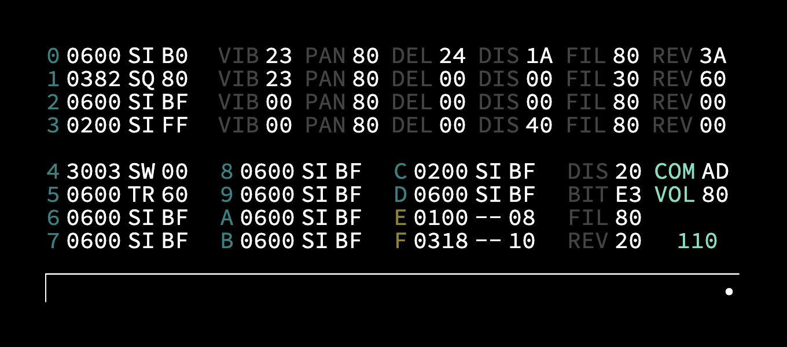

# Aeronaut
Aeronaut is a minimal synthesizer built to be controlled and play sounds by receiving UDP messages. This is very much a rebuild of an amazing synthesizer called [Pilot](https://github.com/hundredrabbits/Pilot) and has also been created to be a companion application to the livecoding environment [ORCA](https://github.com/hundredrabbits/Orca).



## Getting Started
To run Aeronaut, run these commands:

#### **npm**
```
git clone https://github.com/Kyle-Shanks/Aeronaut.git
npm install
npm start
```
#### **yarn**
```
git clone https://github.com/Kyle-Shanks/Aeronaut.git
yarn install
yarn start
```

Standalone builds for Mac/Windows/Linux that can be made for download if there is interest. Feel free to leave an issue on the repo :)

## Overview
Aeronaut is composed of 4 primary synths, 10 simple synths, and 2 noise synths.

The 4 primary synths at the top have their own individual effects (Vibrato, Stereo Panning, Delay, Distortion, Filter, and Reverb) and are routed directly to the master dynamics chain (Compressor and Master Volume).

The 10 simple synths and 2 noise synths share a chain of 4 effects (Distortion, Bit Crusher, Filter, and Reverb) which is then routed to the master dynamics chain.

## Commands
Commands can be received either from UDP (port 49161) or manually input in the input bar on the bottom. Multiple commands can be sent by separating them with a `;`.

e.g. `03C;13d;23a` will play a cm7 [famichord](https://www.youtube.com/watch?v=aEjcK5JFEFE&feature=youtu.be&t=1709)

### Global Commands
Global commands can be run to update master effects and things like the Bpm with these commands:
```
DIS/BIT/FIL/REV - Master effects
COM/VOL - Master Dynamics
BPM - Bpm (Used for note lengths and effects like delay)
```

| Command  | Operation  |   Info   |
| :-       | :-:        | :-:      |
| `DIS20`  | Distortion | Update master distoration    |
| `VOLBF`  | Master Volume | Update master volume to 75%    |
| `BPM110`  | Bpm        | Set Bpm to 110     |

### Channel Commands
Commands can run for a specific channel by using the channel id at the beginning of the command. e.g. `03C` will play a C (3rd Octave) on channel 0.

#### **Note Command Format**
The standard format for playing notes goes:<br/>
`(Channel Id)[0-F] (Octave)[0-6] (Note)[A-z] (Velocity)[0-F] (Length)[0-F]`

For the note input, lowercase letters represent sharps. `e.g. f === F#`

| Command  | Channel | Octave | Note | Velocity | Length |
| :-       | :-:     | :-:    | :-:  | :-:      | :-:    |
| `04C`    | 0       | 4      | C    | _100%_   | _1/8_ |
| `04Ca`   | 0       | 4      | C    | 75%      | _1/8_ |
| `04Cab`  | 0       | 4      | C    | 75%      | 1bar   |

#### **Length Value to Note Length Mapping**
```
0: No Length
1: 1/32nd note
2: 1/24th note
3: 1/16th note
4: 1/12th note
5: Eighth note (1/8)
6: 1/6th note
7: Quarter note (1/4)
8: 1/3rd note
9: Half note (1/2)
A: 3/4th note
B: Whole note/1 bar
C: 1.5 bars
D: 2 bars
E: 3 bars
F: 4 bars
```

#### **Basic Channel Commands**
All channels have a gain envelope, volume, and oscillator (except for noise synths) that can be updated with these basic channel commands:

| Command     | Channel | Name         | Info |
| :-          | :-      | :-           | :-   |
| `0ENV056f`  | 0       | Envelope     | Set **Attack**:0.00, **Decay**:0.33, **Sustain**:0.40 and **Release**:1.00 |
| `1VOLbf`    | 1       | Volume       | Set **Volume**:0.75 |
| `2OSCsq`    | 2       | Oscilloscope | Set **Osc**:Square |

The oscillators available are sine (SI), triangle (TR), square (SQ), and sawtooth(sw).

#### **Primary Synth Commands**
The 4 primary synths also have access to commands that will update their individual effects:

| Command     | Channel | Operation  | Info |
| :-          | :-      | :-         | :-   |
| `0DEL26`    | 0       | Delay      | Set **Delay Time**: 0.125 , **Delay Amount**: 0.4  |
| `3REV20`    | 3       | Reverb     | Set **Reverb Amount**: 0.1255   |

### Effects Description
```
VIB - (Depth [0-F], Rate [0-F])
PAN - (Left amount [00-7F]/Right amount [80-FF])
DEL - (Delay Time[0-F], Wet/Dry [0-F])
DIS - (Wet/Dry [00-FF])
BIT - (Bit Depth [0-F], Wet/Dry [0-F])
FIL - (Lowpass amount [00-7F]/Highpass amount [80-FF])
REV - (Wet/Dry [00-FF])
COM - (Cutoff [0-F], Ratio [0-F])
VOL - (Gain [00-FF])
```

## Presets
A copy of the current state can be saved with `Ctrl+S/Cmd+S`.

A preset can be loaded with `Ctrl+O/Cmd+O`.

## Recording Audio
Press `Ctrl+R/Cmd+R` to record, and press it again to stop and save the recording. Currently outputs a `.opus` file, but this can easily be converted to other formats online.

## TODO List
* Sync delay effect delay time to the bpm
* Add a built in converter from opus to wav
* Use the empty space on noise synths for something to help with more diverse noise sounds. Maybe a filter?